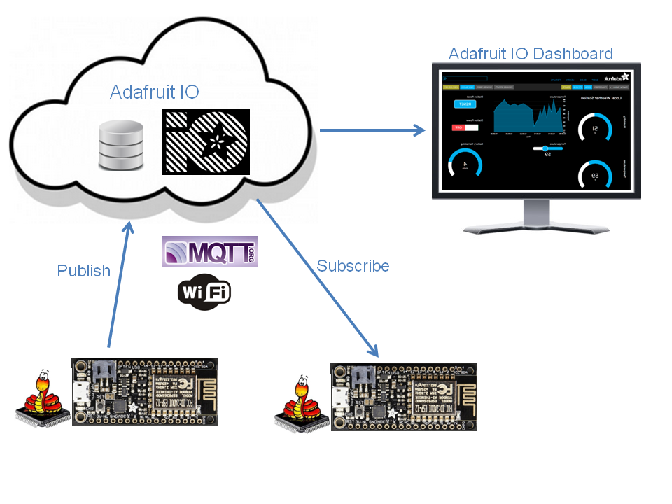
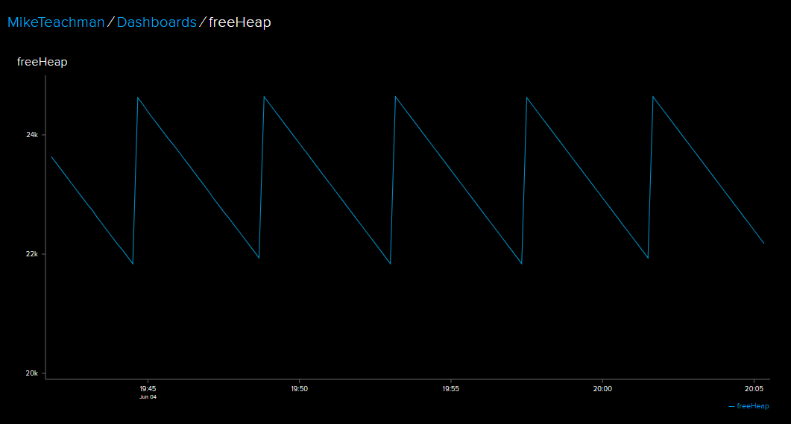

# MQTT protocol with Adafruit IO using MicroPython and CircuitPython
MicroPython and CircuitPython examples showing how to use the [MQTT](http://mqtt.org/faq) protocol with 
the [Adafruit IO](https://io.adafruit.com) cloud service.  Two example code files:
1. Publish the free heap statistics to Adafruit IO
2. Subscribe to the free heap statistics from Adafruit IO



### Hardware Support
* example code tested with 3 boards
  * Adafruit Feather HUZZAH ESP8266
  * Adafruit Feather HUZZAH ESP32
  * WeMos D1 Mini

### Adafruit IO configuration
1. Create an Adafruit IO account at [Adafruit IO](https://io.adafruit.com) and sign in
1. Gather the following Adafruit IO information
    * AIO Key (select "View AIO Key" in Adafruit IO)
    * Adafruit UserName (shown on the same page as the AIO Key)

### Publishing data to Adafruit IO feeds

#### Usage
1. Install the UMQTT Package (if needed)
See section below **Installing UMQTT Package**
1. Configure parameters in file **adafruitPublish.py"**
   * <ENTER_WIFI_SSID>
   * <ENTER_WIFI_PASSWORD>
   * <ENTER_ADAFRUIT_USERNAME>
   * <ENTER_ADAFRUIT_IO_KEY>
1. Copy the file _publishAdafruit.py_ to your device, using [ampy](https://github.com/adafruit/ampy), [rshell](https://github.com/dhylands/rshell), [webrepl](http://micropython.org/webrepl/)
```
$ ampy -pCOMx -d1 put publishAdafruit.py main.py
```
4. Reset the board
1. Navigate to Adafruit IO to see if a new feed has been created called "freeHeap"
1. In the example code freeHeap data is published every 10s
1. Make a dashboard to better visualize the free space on the heap



## Subscribing to Adafruit IO feeds

#### Usage
1. Install the UMQTT Package (if needed)
See section below **Installing UMQTT Package**
1. Configure parameters in file **adafruitSubscribe.py"**
   * <ENTER_WIFI_SSID>
   * <ENTER_WIFI_PASSWORD>
   * <ENTER_ADAFRUIT_USERNAME>
   * <ENTER_ADAFRUIT_IO_KEY>
1. Copy the file _subscribeAdafruit.py_ to your device, using [ampy](https://github.com/adafruit/ampy), [rshell](https://github.com/dhylands/rshell), [webrepl](http://micropython.org/webrepl/)
```
$ ampy -pCOMx -d1 put subscribeAdafruit.py main.py
```
4. Configure a 2nd device to publish the freeHeap data (see above)
1. Reset the board
1. Connect to the REPL with Putty (or simlar) to observe subscribed feed data being received (every 10s in the example code)

### Limitations
* CircuitPython 3.0.0 will continually reset if a secure data connection is enabled

### Tested with these MicroPython Releases
* MicroPython 1.9.3
* MicroPython 1.9.4

### Tested with these CircuitPython Releases
* CircuitPython 2.3.1
* CircuitPython 3.0.0

### Recommended Tools for Windows
* Adafruit Ampy to copy files to the filesystem
    * install version 1.0.3 which has the -d option (use **-d1** to avoid USB connection issues in Windows)
* Putty to interact with the REPL  
    * set Serial speed to 115200 and Flow control to None

## Installing UMQTT Package
The example code requires the MicroPython MQTT (UMQTT) Package.  Some firmware releases have this package built-in, others don't.

| Firmware Release        | umqtt built-in?           | GitHub Library | 
| ------------- |:-------------:| :-----:|
| MicroPython 1.9.3 for ESP8266 | Yes | n/a |
| MicroPython 1.9.4 for ESP8266 | Yes | n/a | 
| MicroPython 1.9.4 for ESP32   | **No** | [Micropython lib](https://github.com/micropython/micropython-lib) |
| CircuitPython 2.3.1 for ESP8266 |  **No** |[CircuitPython lib](https://github.com/MikeTeachman/micropython-lib) |
| CircuitPython 3.0.0 for ESP8266  | **No** | [CircuitPython lib](https://github.com/MikeTeachman/micropython-lib) | 

##### How to install the UMQTT package (if "No" is indicated in the table above)
1. Navigate to the GitHub library indicated in the table 
1. Select the "Clone or download" button
1. Select "Download ZIP"
1. Extract the ZIP.  Should see folder called "micropython-lib-master"
1. Two files need to be copied to the MicroPython filesystem
    * micropython-lib-master\umqtt.robust\umqtt\simple.py
    * micropython-lib-master\umqtt.robust\umqtt\robust.py
  
Copy these two files to MicroPython filesystem with the directory structure shown below.  

```
boot.py
lib
  |
  umqtt
     simple.py
     robust.py
```

Example with Ampy:    
```
>ampy -pCOM27 -d1 ls
boot.py
>ampy -pCOM27 -d1 mkdir lib
>ampy -pCOM27 -d1 mkdir lib/umqtt
>ampy -pCOM27 -d1 put simple.py lib/umqtt/simple.py
>ampy -pCOM27 -d1 put robust.py lib/umqtt/robust.py
>ampy -pCOM27 -d1 ls
boot.py
lib
>ampy -pCOM27 -d1 ls lib
umqtt
>ampy -pCOM27 -d1 ls lib/umqtt
simple.py
robust.py
```
##### Validating the UMQTT package install
From the REPL (using Putty, etc) execute the following commands and observe similar output
```
>>> from umqtt.robust import MQTTClient

>>> dir(MQTTClient)
>>> dir(MQTTClient)
['reconnect', 'log', 'publish', '__module__', 'wait_msg', 'delay', '__qualname__', 'DELAY', 'DEBUG']
```

If you see this result you have successfully installed the umqtt package. :tada: :relieved:

